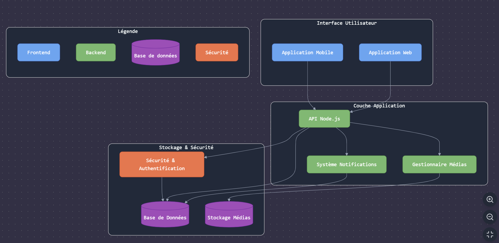

*BAMBIN EBAUCHE CAHIER DES CHARGES*

# 1. Présentation générale du projet

### Contexte et objectifs

L’application vise à améliorer la communication entre les crèches et les parents en proposant un espace sécurisé de partage multimédia, de suivi des activités quotidiennes et d’échange d’informations.

### Public cible

- Parents d’enfants inscrits en crèche
- Personnel de crèche

### Besoins
- Administrateur (directeur de crèche):
    - gestion des paramètres globaux et configuration des droits d'accès
- Personnel de crèche:
    - Publication de contenus multimédias
    - Rédaction des journaux d'activités
    - Communication avec les parents
- Parents:
    - Consultation des contenus partagés
    - Réception des notifications et messages

# 2. Fonctionnalités

### Partie partage multimédia
- Upload sécurisé de photos et sons
- Tagging des enfants sur les photos
- Validation des autorisations parentales
- Gestion des droits à l'image

### Partie journal d’activités
- Création d’un journal quotidien par le personnel encadrant
- Ajout de descriptions des activités (jeux, apprentissages)

### Partie correspondance
- Système de messagerie
- Notifications
- Historique des échanges

# 3. Technologies et architecture technique

Front-end : Vue.js
Back-end : Node.js
Orm : à définir
Base de données : à définir
Stockage des médias : à définir
Authentification : à définir
Gestion des permissions et rôles utilisateurs (Parents, Personnel de crèche, Admin)

4. Sécurité et réglementation

Conformité RGPD
Accès aux médias restreint aux parents concernés
Consentement explicite pour l’utilisation des photos
Droit de rectification et d'effacement
Durée conservation des données sur les enfants : https://www.cnil.fr/fr/cnil-direct/question/combien-de-temps-une-creche-peut-elle-conserver-des-informations-sur-les
